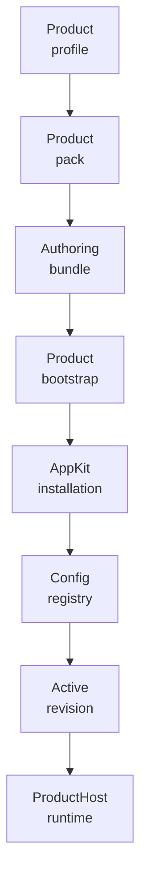
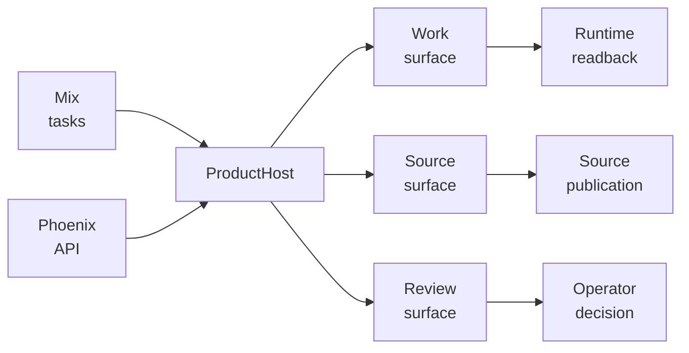
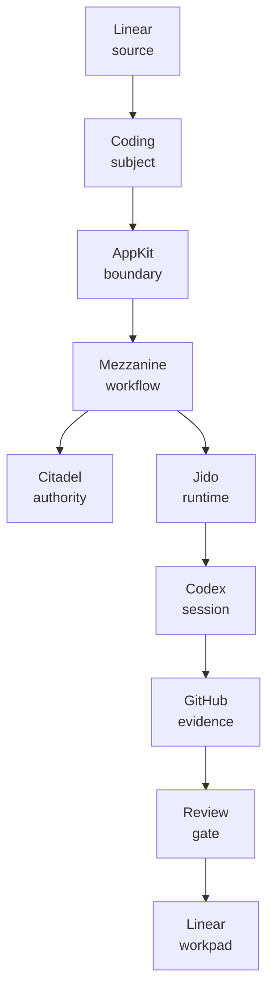

<p align="center">
  
</p>

<p align="center">
  <a href="https://github.com/nshkrdotcom/extravaganza">
    
  </a>
  <a href="https://github.com/nshkrdotcom/extravaganza/blob/main/LICENSE">
    
  </a>
</p>

# Extravaganza

## Quickstart

1. Clone and enter the repo:

   ```bash
   git clone git@github.com:nshkrdotcom/extravaganza.git
   cd extravaganza
   ```

2. Install deps and run the baseline checks:

   ```bash
   mix deps.get
   mix ci
   ```

3. Run the fixture-backed headless smoke proof:

   ```bash
   MIX_ENV=test mix extravaganza.headless.smoke --deterministic --same-run --json
   ```

4. Run live provider paths through the same product command surface:

   ```bash
   mix extravaganza.headless.live.smoke --live-product-path --ack-headless-guardrails --json
   ```

   If you want live examples to attempt provider execution, export provider
   credentials in the shell before running the command, for example:

   ```bash
   export LINEAR_API_KEY=...
   export OPENAI_API_KEY=...
   export CODEX_API_KEY=...
   export GH_TOKEN=... # or GITHUB_TOKEN
   ```

   Then rerun:

   ```bash
   mix extravaganza.headless.live.smoke --live-product-path --ack-headless-guardrails --json
   ```

   `--ack-headless-guardrails` is required for live provider paths and
   non-fixture mutating commands. The Symphony preview flag
   `--i-understand-that-this-will-be-running-without-the-usual-guardrails` is
   also accepted for CLI compatibility.

   See `guides/headless_provider_credentials.md` for the full example
   matrix and verification checks by provider.

5. For the full API/operator view:

   ```bash
   mix phx.server
   ```

   Then use the `guides/headless_live_demo.md` walkthrough for route-level and script-level onboarding.

Extravaganza is the first proving-ground product application for the nshkr
stack. It is an Elixir/OTP umbrella (`extravaganza_core` + `extravaganza_web`)
that stays intentionally thin: its job is to prove a coherent operator surface
above `app_kit` while pushing all reusable business semantics, workflow
machinery, and configurable operational logic down into `mezzanine`.

Extravaganza is the enterprise distributed port of the
[OpenAI Symphony](https://github.com/openai/symphony) headless coding-agent
orchestration pattern. Symphony defines a language-agnostic service that
continuously reads work from an issue tracker, creates isolated per-issue
workspaces, and drives a coding agent session for each item. Extravaganza ports
that concept onto the nshkr substrate: Temporal-backed durable workflows,
multi-tenant authorization, operator review gates, evidence collection, and
structured audit trails replace Symphony's intentionally simple in-memory
single-node design.

## Stack position

```
Extravaganza          ← this repo: product UX, operator journeys, pack authoring
  └─ app_kit          ← northbound surfaces, governed product boundary
       └─ mezzanine   ← reusable business engines, Temporal-backed workflows
            └─ citadel / outer_brain / jido_integration
                 └─ execution_plane
```

`app_kit` is the only allowed entry point for governed product behavior.
Extravaganza's sole direct Mezzanine coupling is the pure `Mezzanine.Pack`
model contract used to author its product pack. Everything else — bootstrap,
intake, operator queue/detail, review decisions, pause/resume/cancel, trace
lookup, semantic assist, source publication, and lower read leases — goes
through typed `AppKit.*` surfaces.

The CI gate (`mix app_kit.no_bypass`) enforces this boundary continuously with
both `product` and `hazmat` profiles so it is a hard rule, not a convention.

## Current usable product surface

Extravaganza is currently a headless coding-ops product, not just a scaffold.
The product can be exercised from three operator-facing surfaces that all stay
above AppKit:

- Mix tasks for deterministic local proof, live provider smoke, queue/state
  inspection, source preview/sync/publish, profile validation/reload, evidence
  lookup, event stream readback, and review decisions
- a Phoenix JSON API for the same state, source, run, evidence, review,
  profile, event, refresh, publication, and lower-read surfaces
- the `Extravaganza.ProductHost` facade for product-owned code paths that need
  to bootstrap the pack, submit or refresh work, inspect runs, and apply
  operator controls without importing lower repos directly

The current work completed in this product centers on making the Symphony-style
coding-agent loop inspectable and repeatable through the actual product path.
Recent shipped surfaces include Codex first-prompt rendering, app-server
protocol readback, session-start and session-stop readback, continuation turn
proof, event-stream proof, token-total readback, runtime snapshot parity,
stalled-run readback, stall-policy readback, startup cleanup status, running
source reconciliation, retry due-time and backoff readback, stale retry-token
protection, queue dispatch eligibility reasons, pre-dispatch revalidation, and
worker-placement settings.

The source side is also product-visible now. The headless path exposes Linear
candidate DTO parity, subject readback parity, current-state live examples,
GraphQL dynamic-tool examples, publication dry-run proof, publication write
variants, source blocker denial readback, source payload readback, and refresh
ticks for poll reconciliation. The evidence side exposes GitHub PR evidence
runtime proof and Codex session evidence through the same product-owned command
and API path.

What this means in practice:

- `MIX_ENV=test mix extravaganza.headless.smoke --deterministic --same-run --json`
  is the local fixture-backed product proof.
- `mix extravaganza.headless.live.smoke --live-product-path --ack-headless-guardrails --json` exercises
  the same product command surface against live provider paths when credentials
  are present.
- `mix phx.server` exposes the API routes used by operator tooling and browser
  shells: state, status, logs, profile validate/reload, source publication,
  subjects, runs, evidence, events, refresh, action controls, reviews, review
  decisions, and issue-identifier lookup.
- Product code sees DTOs and product-level commands. Durable workflows,
  connector credentials, provider calls, source admission, lower facts, and
  governance enforcement remain below AppKit.

The usable feature today is therefore a full headless product proof and an API
operator shell for governed coding-agent work. It is not yet a polished browser
application, and it does not claim live provider acceptance unless the live
command path is run with real credentials and the lower stack substrate is up.

## What this repo owns

- Product UX and operator journeys
- Product identity, configuration, and pack authoring
- Product defaults: policy bundle, work class, placement profile, source binding
- Product prompts and operator review workpad templates
- Safe defaults for local and single-user proving deployments
- `Extravaganza.ProductHost` — the unified product host facade

## What this repo does not own

- Workflow engines or runtime bridges
- Generic governance, review gating, or audit assembly
- Lower execution, connector credential handling, or source admission
- Reusable operational state models or business orchestration

## Product modules

| Module | Role |
|---|---|
| `Extravaganza.Config` | Normalized product configuration |
| `Extravaganza.ProductProfile` | Default install and routing profile |
| `Extravaganza.ProductPack` | `Mezzanine.Pack` manifest for the coding-ops workflow |
| `Extravaganza.DefaultAuthoringBundle` | ProductPack/default policy compiler into the AppKit authoring-bundle import envelope |
| `Extravaganza.PolicyPresets` / `WorkClasses.*` | Product-owned policy and work-class defaults |
| `Extravaganza.ProductBootstrap` | Idempotent durable bootstrap via `AppKit.InstallationSurface` |
| `Extravaganza.ProductHost` | Operator facade over `AppKit.Work*`, `AppKit.OperatorSurface`, `AppKit.ReviewSurface` |
| `Extravaganza.CodingOpsTemplates` | Coding-agent system prompt and review workpad copy |

## Default product pack

The coding-ops product pack declares the Linear-to-governed-Codex review lane.
Current deterministic fixture evidence covers product pack bounds,
authoring-bundle activation, tenant and authority admission, governed Codex
strict-mode materialization, deterministic receipt-shaped projection, governed
operator controls, and restart/fencing. That fixture evidence is not product
completion: the non-fixture headless start path, same-run deterministic smoke,
and live Linear, GitHub, or Codex examples must run through the product-owned
Extravaganza command path before headless completion is claimed.

| Dimension | Default |
|---|---|
| Program slug | `extravaganza_coding_ops` |
| Source binding | `linear_primary` (Linear → `coding_task` subjects) |
| Execution recipe | Codex session, 12-turn budget, 300 s stall timeout |
| Dynamic tools | Declared `linear.comments.update`, `linear.graphql.execute`, and GitHub PR operations governed by connector manifests |
| Review gate | Operator review, 72-hour window |
| Required evidence | `github_pr`, `codex_session`, `source_workpad` |
| Operator controls | accept, rework, cancel, and refresh through AppKit and Mezzanine governed owner paths |
| Lifecycle | submitted → awaiting\_review → completed / rejected / expired |

ProductPack config names are bounded product inputs. The default pack accepts
only `coding_task` for `work_class_kind`, `linear` for `linear_source_kind`,
`coding_operations` for `work_class_name`, and `local_default` for
`placement_profile_id`; the derived source binding is the fixed
`linear_primary` ref. Unknown names raise before manifest refs are built, so
human-authored config cannot create BEAM atoms through ProductPack.

Runtime policy authority is the checksum/schema-validated authoring bundle
imported through `AppKit.InstallationSurface.import_authoring_bundle/3` and the
activated installation revision returned by the lower registry. `ProductPack`
is the default seed. `Extravaganza.PolicyPresets.DefaultCodingOps.workflow_body/0`
is prompt/template text only; its runtime config is carried as structured
metadata for Mezzanine `:structured_config` policy bundles instead of YAML
front matter in the prompt body.

Process environment variables are not governed product authority. Phoenix boot
configuration may use deployment env for web server startup, and tests may use
restored env gates for optional live smoke selection, but ProductPack,
ProductProfile, authoring bundles, source bindings, provider identity, base
URLs, tokens, targets, and operator policy all remain explicit AppKit or lower
authority inputs.

Source publication (the Linear workpad comment update) is an intended workflow
effect for subjects that enter `awaiting_review`. The write is owned by the
workflow/source-publisher path below AppKit. The v1 release evidence covers
deterministic workpad rendering, projection, and readback through
`AppKit.WorkSurface` DTOs; it does not claim live Linear mutation.

## Boot flow

```
Application start
  └─ internal OTP bootstrap worker
       └─ Extravaganza.ProductBootstrap
            ├─ AppKit.InstallationSurface.create_installation/2
            └─ AppKit.InstallationSurface.import_authoring_bundle/3

Product-host run
  └─ Extravaganza.ProductHost
       ├─ AppKit.WorkControl / AppKit.WorkSurface
       ├─ AppKit.OperatorSurface
       ├─ AppKit.ReviewSurface
       └─ Mezzanine.AppKitBridge  (owned by app_kit, not this repo)
```

## Product Flow Diagrams







Real Linear source events enter below the product boundary through Jido
Integration and Mezzanine source admission. Extravaganza owns source defaults
and credential-free test fixtures only.

Bootstrap uses `create_installation/2` when an active pack registration already
exists, then imports the default authoring bundle through AppKit. When the
lower registry has no active registration yet, the bundle import creates and
activates the installation revision atomically through ConfigRegistry; product
code still does not call ConfigRegistry directly.

## Development

Targets Elixir `~> 1.19` and Erlang/OTP `28`.

```bash
mix deps.get
mix ci
```

`mix ci` runs the full quality sequence:

1. `deps.get`
2. AppKit no-bypass boundary scan (`product` + `hazmat` profiles)
3. `format --check-formatted`
4. `compile --warnings-as-errors`
5. `test` (with `ash.setup`)
6. `credo --strict`
7. `dialyzer --force-check`
8. `docs --warnings-as-errors`

The boundary scan command run by CI:

```bash
mix app_kit.no_bypass --root . \
  --profile product \
  --profile hazmat \
  --include "apps/extravaganza_core/lib/**/*.ex" \
  --include "apps/extravaganza_web/lib/**/*.ex"
```

Oban is configured for Mezzanine's retained local duties only
(workflow-start outbox, workflow-signal outbox, claim-check GC). Live
orchestration state is projected from Mezzanine workflow facts through AppKit
surfaces; Extravaganza does not treat Oban as a durable workflow engine.

## Temporal development substrate

Temporal runtime development is managed from the `mezzanine` repo via its
`just` workflow. Do not start ad hoc Temporal processes.

```bash
cd /home/home/p/g/n/mezzanine
just dev-up        # start local Temporal dev server
just dev-status    # check health
just dev-logs      # tail logs
just temporal-ui   # open UI at http://127.0.0.1:8233
```

Local contract: `127.0.0.1:7233`, namespace `default`, persistent state at
`~/.local/share/temporal/dev-server.db`.

## Escalation path

If product work needs a platform capability that AppKit does not yet expose,
add the AppKit surface or lower contract first. Do not import lower platform
modules directly from product business code.

## Further reading

- [Overview](docs/overview.md)
- [Stack Position](docs/stack_position.md)
- [Product Direction](docs/product_direction.md)
- [Product Profile](docs/product_profile.md)
- `docs/persistence.md`
- `docs/product_no_bypass.md`

## Guides

- [Headless Live Demo Onboarding](guides/headless_live_demo.md)
- [Headless API Reference](guides/headless_api_reference.md)
- [Headless Symphony Gap Analysis](guides/headless_symphony_headless_gap_analysis.md)
- [Headless Provider Credentials and Verification](guides/headless_provider_credentials.md)

## Persistence Documentation

See `docs/persistence.md` for tiers, defaults, adapters, unsupported selections, config examples, restart claims, durability claims, debug sidecar behavior, redaction guarantees, migration or preflight behavior, and no-bypass scope when applicable.
